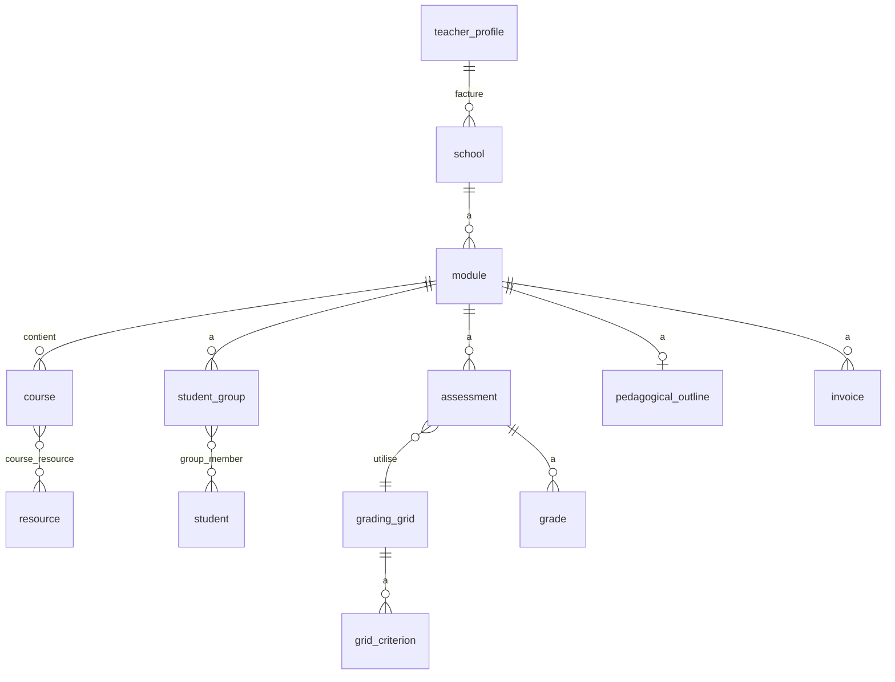

# Modèle de données

> Noms de tables et colonnes **en anglais** `snake_case`. Proposition — finalisée par
> l'Architecte en E1. Volontairement minimal (pas de versioning ni d'audit en MVP).

## Hiérarchie (d'après l'espace Notion de Marie)

`resource` (réutilisable) ──< `course_resource` >── `course` >── `module` >── `school`

Une **ressource** générique est réutilisée dans N **cours** ; chaque cours appartient à
un **module** (école + année) ; le module porte le YCODE, les heures, la trame et la
facturation.

## Tables

| Table                 | Colonnes clés                                                                                                                                                                               |
| --------------------- | ------------------------------------------------------------------------------------------------------------------------------------------------------------------------------------------- |
| `resource`            | title, description, content (markdown), url, category, tags[], files(jsonb)                                                                                                                 |
| `module`              | name, school_id, level, year, ycode, total_hours, start_date, first_session_date, end_date, iceberg_state, trame_state, trame_sent_at, billing_state, purchase_order_ref, admin_docs(jsonb) |
| `course`              | module_id, title, position, session_date, type, learning_objectives[], content_last_updated_at                                                                                              |
| `course_resource`     | course_id, resource_id, role (`primary` \| `secondary`)                                                                                                                                     |
| `student`             | first_name, last_name, email, photo_url, student_number, personal_notes                                                                                                                     |
| `student_group`       | module_id, name, type (`tp` \| `td` \| `project`)                                                                                                                                           |
| `group_member`        | student_group_id, student_id                                                                                                                                                                |
| `assessment`          | module_id, group_id?, title, type, coefficient, date, subject, is_group_grade                                                                                                               |
| `grading_grid`        | name, description                                                                                                                                                                           |
| `grid_criterion`      | grading_grid_id, label, weight, description                                                                                                                                                 |
| `grade`               | assessment_id, student_id?, group_id?, value, feedback, is_group_grade, scores(jsonb)                                                                                                       |
| `predefined_comment`  | text, category (`positive` \| `negative` \| `advice`), tags[]                                                                                                                               |
| `invoice`             | module_id, number (`YYYY-NNN`), issued_on, amount_ex_vat, vat_rate, vat_amount, amount_inc_vat, status, purchase_order_ref, sent_at, paid_on, xml_file, pdf_file                            |
| `pedagogical_outline` | module_id, generated_at, content(jsonb), status, sent_at, pdf_file                                                                                                                          |
| `module_document`     | module_id, kind (`school_expectations` \| `outline_sent`), name, path (bucket privé `module-documents`), size_bytes, mime                                                                   |
| `school`              | name, siret, address, billing_email, pa_identifier                                                                                                                                          |
| `teacher_profile`     | legal_name, address, siret, vat_number, bank_details, email                                                                                                                                 |

## Transverse

- `id uuid primary key default gen_random_uuid()`
- `owner_id uuid not null default auth.uid()` + **RLS** `owner_id = auth.uid()` (select/insert/update/delete)
- `created_at` / `updated_at timestamptz` + trigger `updated_at`
- `required_notes(total_hours)` : fonction pure (TS) — cf. `src/lib/ynov/notation.ts`

## Simplifications assumées (cf. `DECISIONS.md`)

- Fusion Notion « Séance » / « Activité pédagogique » → `course`.
- Pas de `resource` versioning, pas de `change_log` en MVP.
