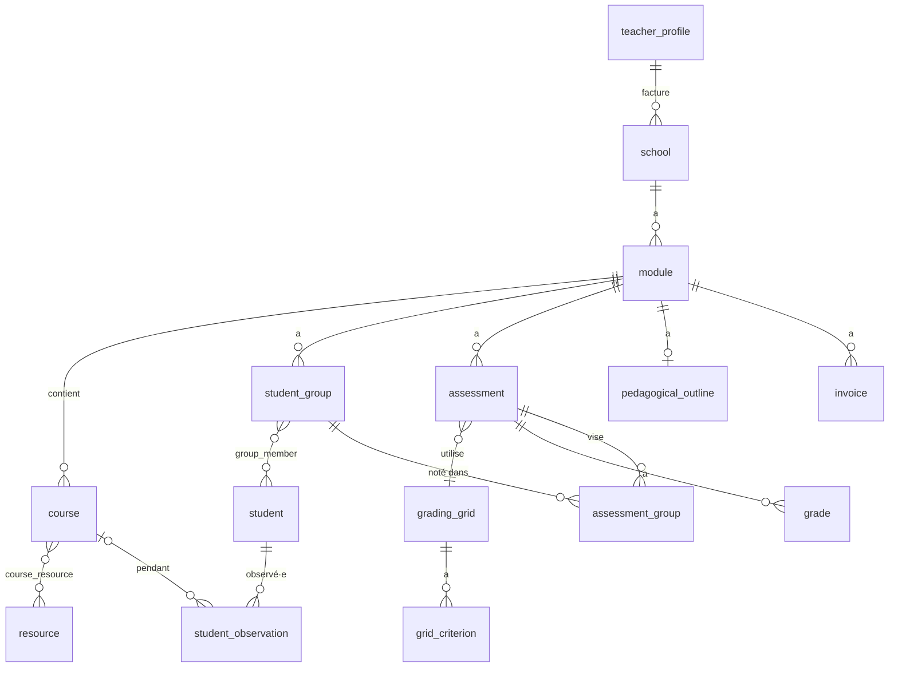

# Modèle de données

> Noms de tables et colonnes **en anglais** `snake_case`. Proposition — finalisée par
> l'Architecte en E1. Volontairement minimal (pas de versioning ni d'audit en MVP).

## Hiérarchie (d'après l'espace Notion de Marie)

`resource` (réutilisable) ──< `course_resource` >── `course` >── `module` >── `school`

Une **ressource** générique est réutilisée dans N **cours** ; chaque cours appartient à
un **module** (école + année) ; le module porte le YCODE, les heures, la trame et la
facturation.

```mermaid
erDiagram
  school ||--o{ module : "a"
  module ||--o{ course : "contient"
  course }o--o{ resource : "course_resource"
  module ||--o{ student_group : "a"
  student_group }o--o{ student : "group_member"
  module ||--o{ assessment : "a"
  assessment }o--|| grading_grid : "utilise"
  grading_grid ||--o{ grid_criterion : "a"
  assessment ||--o{ grade : "a"
  assessment ||--o{ assessment_group : "vise"
  student_group ||--o{ assessment_group : "noté dans"
  module ||--o| pedagogical_outline : "a"
  module ||--o{ invoice : "a"
  student ||--o{ student_observation : "observé·e"
  course |o--o{ student_observation : "pendant"
  teacher_profile ||--o{ school : "facture"
```

## Tables

| Table                 | Colonnes clés                                                                                                                                                                                                                             |
| --------------------- | ----------------------------------------------------------------------------------------------------------------------------------------------------------------------------------------------------------------------------------------- |
| `resource`            | title, description, content (markdown), url, **kind** (`resource_kind`, nullable), **audience** (`students` \| `teacher`, défaut `students`), **status** (`resource_status` : `ready` défaut \| `progress` = « à construire »), intent_note, category (= matière), tags[], files(jsonb, bucket `resource-files`)                         |
| `module`              | name, school_id, level, year, ycode, total_hours, start_date, first_session_date, end_date, iceberg_state, trame_state, trame_sent_at, billing_state, purchase_order_ref, admin_docs(jsonb), slides_url, student_intro (markdown projeté) |
| `course`              | module_id, title, position, session_date, **start_time**, **end_time** (`time`, nullable), type, learning_objectives[], content_last_updated_at ; clôture privée (US-67) : completion (`course_completion`, nullable), not_covered, next_time, retro_note                                  |
| `course_resource`     | course_id, resource_id, role (`primary` \| `secondary`)                                                                                                                                                                                   |
| `module_resource`     | module_id, resource_id — ressources **retenues** pour un module (unique `module_id + resource_id`), proposées en tête à la liaison de séance (US-55) |
| `module_expectation`  | module_id, kind (`expectation_kind` : `objective` \| `unit`), label, position, hours (numeric, nullable, unités seulement), modality (`FFP` \| `TDP`, nullable) — attendus de la fiche YNOV (US-53) ; les unités sont des repères indicatifs |
| `course_expectation`  | course_id, expectation_id — attendus couverts par une séance (unique `course_id + expectation_id`, US-54) |
| `student`             | first_name, last_name, email, photo_url, student_number, personal_notes                                                                                                                                                                   |
| `student_year`        | student_id, year (année de rentrée, 2025 → « 2025-26 »), scholar_group (promotion de l'année, nullable) — unique `student_id + year` (US-80b). `student.scholar_group` est déprécié : plus lu ni écrit |
| `student_group`       | module_id, name, type (`tp` \| `td` \| `project`)                                                                                                                                                                                         |
| `group_member`        | student_group_id, student_id                                                                                                                                                                                                              |
| `student_observation` | module_id, course_id? (`on delete set null`), student_id, tag (`observation_tag`), note — observations privées prises en séance (US-65), jamais projetées, exportées ni envoyées                                                          |
| `assessment`          | auto_validated_criterion_ids uuid[] (critères validés d'office, US-82), module_id, title, type, coefficient, date, subject, is_group_grade, max_score (barème, vide = total grille sinon 20), results_sent_at (dernier envoi des résultats par e-mail)                                                            |
| `assessment_group`    | assessment_id, student_group_id — groupes visés par l'évaluation (≥ 1, paire unique)                                                                                                                                                      |
| `grading_grid`        | name, description                                                                                                                                                                                                                         |
| `grid_axis`           | grading_grid_id, label, position — axes d'une grille, chacun avec son sous-total (US-82) |
| `grid_criterion`      | grading_grid_id, label, weight, description, axis_id? (`on delete set null`), reference?, is_bonus (hors barème)                                                                                                                                                                                               |
| `criterion_level`     | grid_criterion_id, points, description, position — paliers d'un critère (unique `(critère, points)`), du plus haut au plus bas ; `grid_criterion.weight` = palier le plus haut (US-81) |
| `grade`               | assessment_id, student_id?, group_id?, value, feedback, is_group_grade, scores(jsonb), criterion_comments(jsonb `{critère: texte}`), strengths?, progress?, feedback? (commentaire libre)                                                                                                                                                     |
| `predefined_comment`  | text, category (`positive` \| `negative` \| `advice`), tags[], subject? (matière), grid_criterion_id? (`on delete set null`) + criterion_label? (recopié), use_count, last_used_at — phrases réutilisables (US-84) ; `bump_comment_use(id)` incrémente l'usage |
| `invoice`             | module_id, number (`YYYY-NNN`), issued_on, amount_ex_vat, vat_rate, vat_amount, amount_inc_vat, status, purchase_order_ref, sent_at, paid_on, xml_file, pdf_file                                                                          |
| `pedagogical_outline` | module_id, generated_at, content(jsonb), status, sent_at, pdf_file                                                                                                                                                                        |
| `module_document`     | module_id, kind (`school_expectations` \| `outline_sent` \| `external_invoice`), name, path (bucket privé `module-documents`), size_bytes, mime                                                                                           |
| `resource_version`    | resource_id, title, description, content, url, category, tags (copie de l'état précédent, déclencheur `resource_snapshot`, 30 max)                                                                                                        |
| `school`              | name, siret, address, billing_email, pa_identifier                                                                                                                                                                                        |
| `teacher_profile`     | legal_name, address, siret, vat_number, activity_number (NDA), bank_details, email                                                                                                                                                        |

## Enums ressources

- `resource_kind` : `course`, `workshop`, `project`, `template`, `answer_key`, `question_bank`,
  `reference`, `teacher_notes` (libellés FR dans `src/lib/resources/kind.ts`).
- `resource_audience` : `students`, `teacher` — `teacher` n'est **jamais** diffusé aux
  étudiant·es (`studentFacing()`).

## Enums carnet de séance (privé)

- `observation_tag` : `relevant_question`, `participation`, `difficulty`, `absent_late`, `other`
  (libellés FR dans `src/lib/notebook/notebook.ts`).
- `course_completion` : `done`, `partial`, `not_done`.
- Garde-fou : `src/lib/notebook/privacy.test.ts` vérifie qu'aucun code d'export PDF, d'e-mail ou
  de présentation ne lit ces données.

## Transverse

- `id uuid primary key default gen_random_uuid()`
- `owner_id uuid not null default auth.uid()` + **RLS** `owner_id = auth.uid()` (select/insert/update/delete)
- `created_at` / `updated_at timestamptz` + trigger `updated_at`
- `required_notes(total_hours)` : fonction pure (TS) — cf. `src/lib/ynov/notation.ts`

## Simplifications assumées (cf. `DECISIONS.md`)

- Fusion Notion « Séance » / « Activité pédagogique » → `course`.
- Pas de `resource` versioning, pas de `change_log` en MVP.
